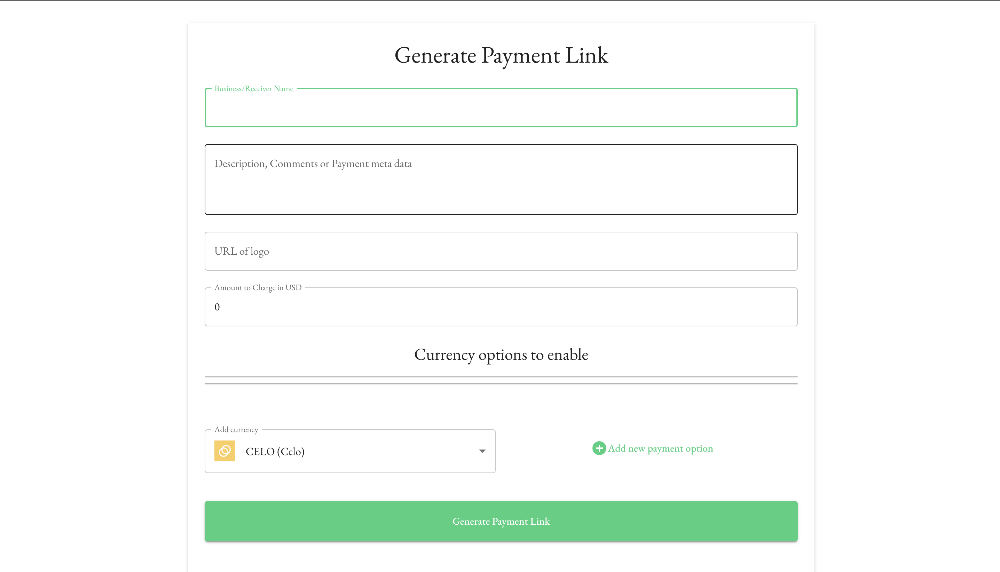
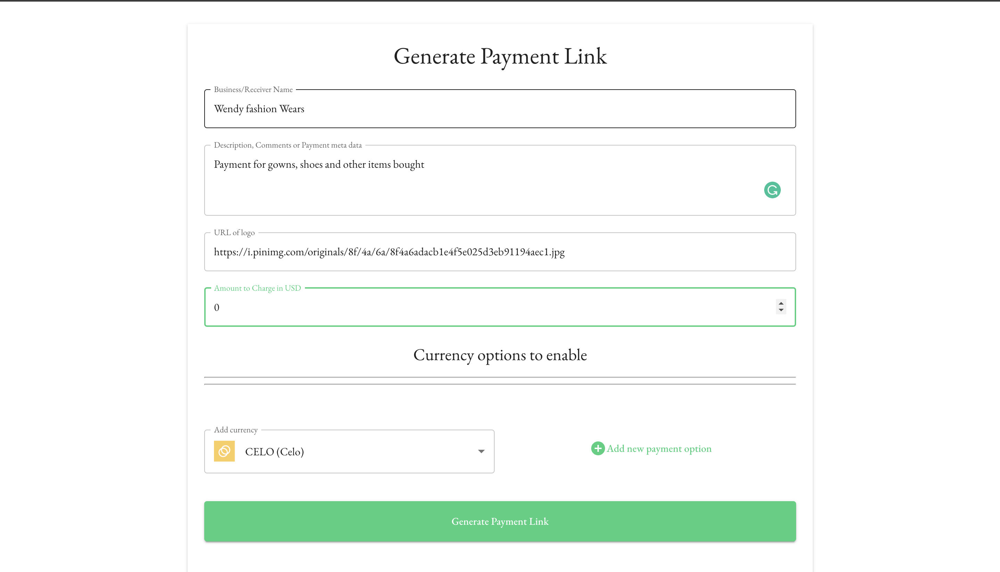
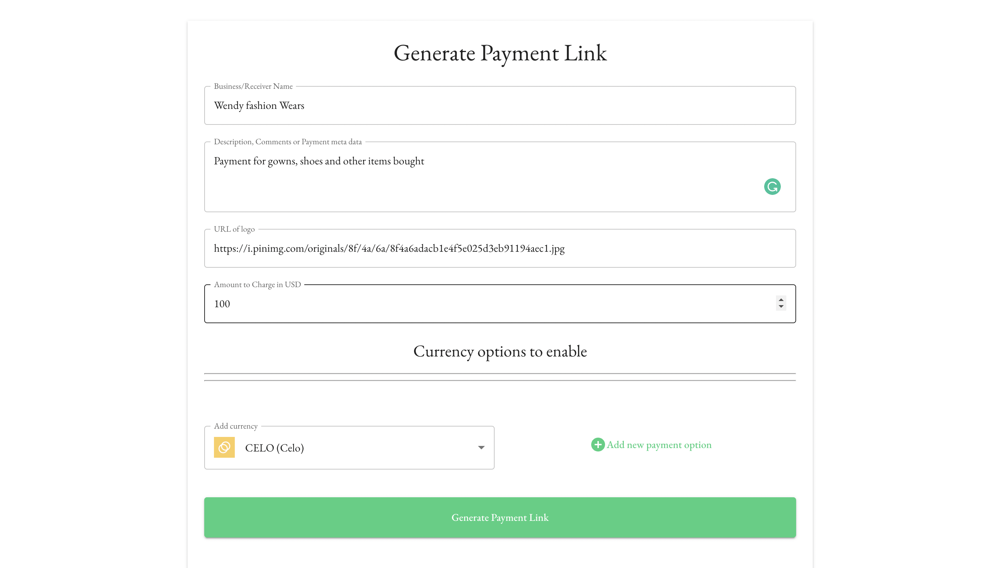
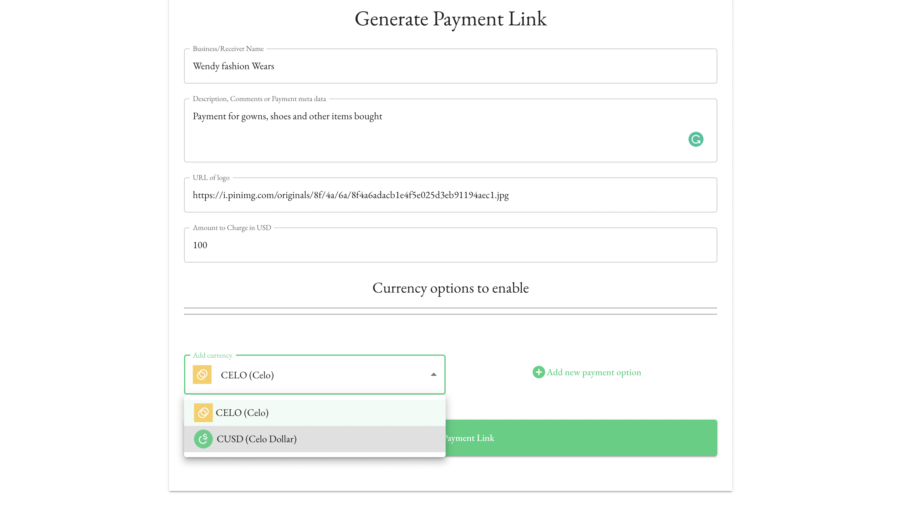
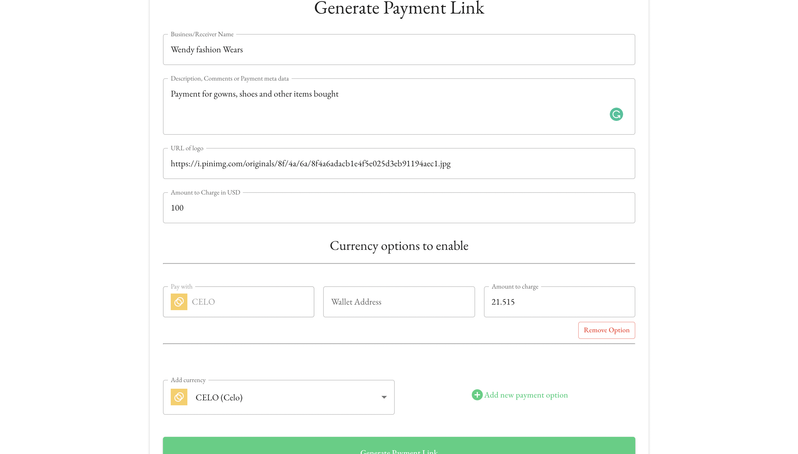
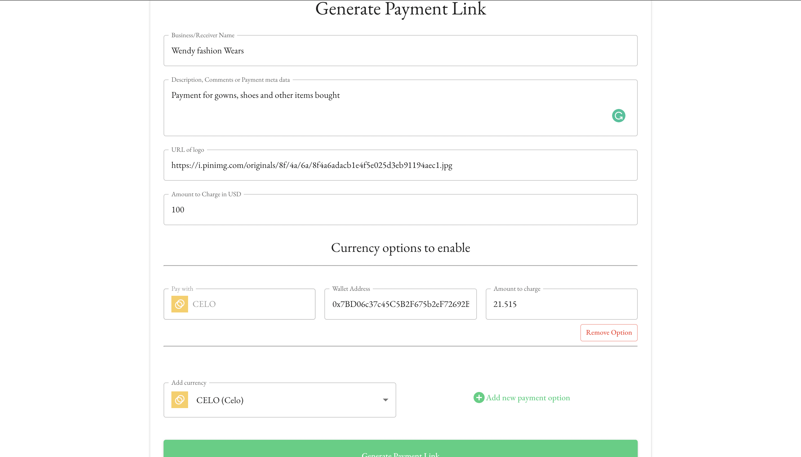
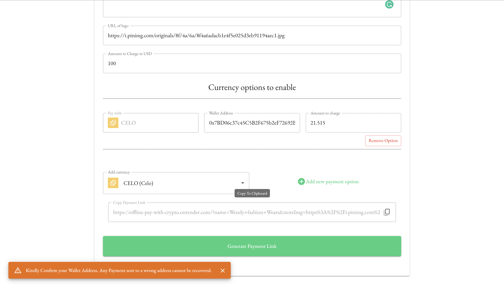
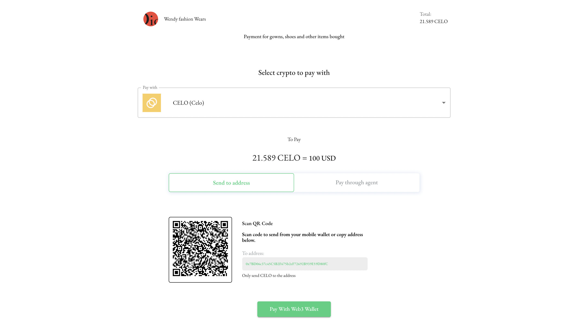

import PageRef from '../src/components/PageRef'

## Accept Payments

Offline Pay with Celo was designed to provide great user experience and ease to use for users without prior experience in crypto.

## Use Cases

- ### _Efficient Cross Border Payment_

  Most businesses rely on traditional banks transfers or credit card to make payment globally, which is regulated and restricts business transactions in certain countries. With _`Offline Pay With Celo`_, you can signficantly run an efficent payment system for your business.

- ### _Faster Transactions_

  Shortens receiving cross-border payments process to less than `10 seconds`.

- ### _Save more than 50% cost on fiat-based transactions_

  Uses stable coins to reduce bank and third-party intermediaries fees. You can now enjoy [low-cost](https://docs.celo.org/celo-codebase/protocol/transactions/erc20-transaction-fees) cross border payments with _`Offline Pay With Celo`_.

- ### _No Signups: Ease to use_
  Simply by setting up a wallet address in simple steps, your business can recieve payments seamlessly and avoid long signup processes.

## Next Steps

### Get A Wallet:

Wallets are tools that create accounts, manage keys, and help users transact on the Celo network.

It's important to be careful when choosing a wallet because they manage your secret account keys. You should only use reputable wallets that are well maintained by organizations/people that you trust.

- #### Celo Wallet

  The [CeloWallet](https://celowallet.app/setup) is a lightweight, mobile-friendly wallet for both web and desktop. It supports core Celo functionality like payments, exchanges, staking, and governance. It is an easy way to send, receive, and save Celo Assets.

- #### Valora Mobile App

  Valora is a mobile wallet focused on making global peer-to-peer payments simple and accessible to anyone. It supports the Celo Identity Protocol which allows users to verify their phone number and send payments to their contacts.

  [Valora App](https://valoraapp.com/) : Available on Android and iOS

- #### Metamask
  [MetaMask](https://metamask.io)

### Request Payment

- #### Visit Offline Pay With Celo Site : https://offline-pay-with-crypto.onrender.com/

- #### Fill in the required information about the payment.

- #### Enter the amount you want to charge.

#### NB: This amount should be in _USD_

- #### Select currencies you want to accept payment in, Celo or cUSD

  - Choose a currency option from the select dropdown

    

  - Click on **"Add Payment Option Button"** to add a currency option, on addition. The currrent exchange value is set to "Amount to Charge" field. You can choose to update this manually

    

- #### Enter your wallet address from the Wallet you downloaded above

  

NB: **Kindly, Confirm your wallet adress before generate a payment link as transactions done are irreversible.**

- #### Share the payment link with the Person you want to accept payment from

  - Finally Click on **"Generate Payment Link"** to get a shareable payment link with your customers/senders

    

  - Copy and Visit the link to preview the payment page

    

### Confirm Payment

You will be notified by Valora when payment arrives. Or you can check your Wallet balance after they have paid.

## Related

<PageRef url="/docs/send-valora" pageName="Make Payments With Valora App" />
